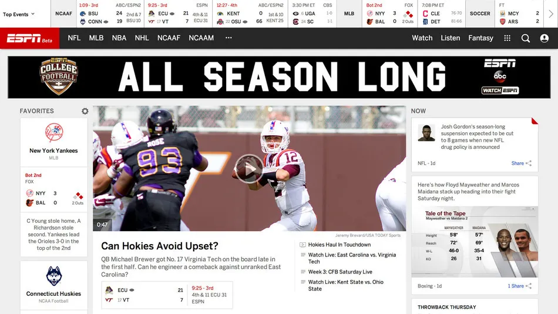
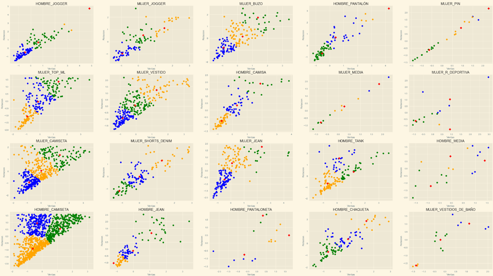
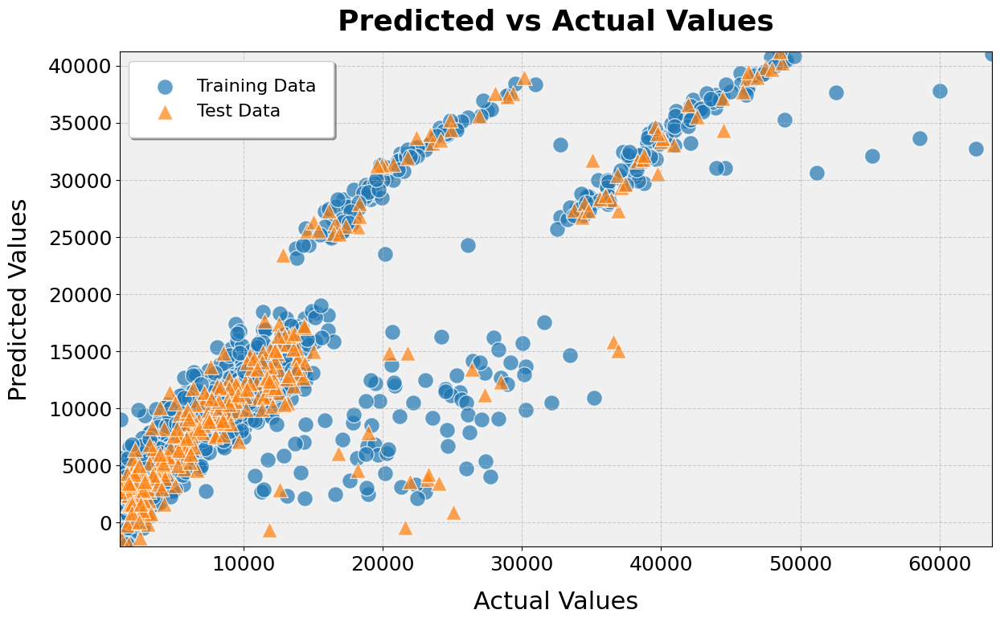
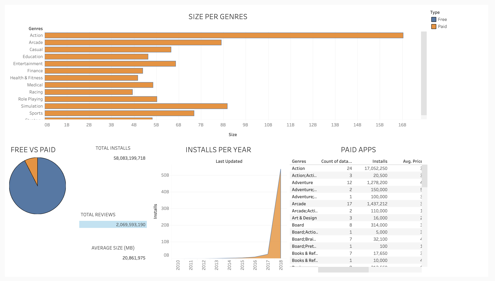

# 🌟 Data Scientist Portfolio 🌟

Welcome to my **Data Scientist Portfolio**. Here, you will find various projects showcasing my skills and work in data science.

## Projects 🚀

### 1. -  📊 Predicción de Calificación
This project involves conducting a study of the characteristics of items that were rated as winners and those that were rated as losers to determine which have the potential to be one or the other. The goal is to choose the best type of clothing for the future in a clothing company.

Repositorio completo: [https://github.com/DeiviGT1/prediccion-de-calificacion](https://github.com/DeiviGT1/prediccion-de-calificacion)

### 2. 📦 Distribución de Sobrantes
An analysis project focused on the distribution of excess inventory in supply chain management. This project aims to optimize inventory levels and reduce waste by analyzing surplus distribution patterns.

Complete repository: [https://github.com/DeiviGT1/distribucion_sobrantes](https://github.com/DeiviGT1/distribucion_sobrantes)

### 3. 🌐 Web Scraping
A project demonstrating web scraping techniques to gather data from websites. It includes examples of scraping e-commerce sites, social media, and news websites to extract useful information for analysis.

### 4. 🔧 Dim Fix (Work in Progress)
This project is currently under development. It involves fixing dimensional issues in datasets to ensure data quality and consistency. The project aims to provide tools and methods for cleaning and transforming data.

Complete repository: [https://github.com/DeiviGT1/](https://github.com/DeiviGT1/DS)

### 5. 📈 KMeans
This project reviews items (clothing) and rates them according to their sales and turnover using the KMeans algorithm. It uses matrices provided by the company to determine these classifications.

Complete repository: [https://github.com/DeiviGT1/kmeans](https://github.com/DeiviGT1/kmeans)

### 6. ⚙️ Fix Sklearn Analytics
This is a university-proposed project that involves working with various algorithms to solve a series of datasets efficiently. The focus is on enhancing existing models, optimizing techniques, and performance benchmarking.

Complete repository: [https://github.com/DeiviGT1/sklearn_analytics](https://github.com/DeiviGT1/sklearn_analytics)

### 7. 📊 Dashboard
This was an example that I made to show my habilities by managing dashboards, even when I have much more experience using Power BI instead of Tableau but I don't have the licence anymore so for the example I had to use the second one. It's a database with data of Google Play Store downloaded and fixed using Python, also used Postgres to manage the database with SQL and finally imported the data to tableau

Complete repository: [https://github.com/DeiviGT1/portafolio-data-science/tree/master/tableau](https://github.com/DeiviGT1/portafolio-data-science/tree/master/tableau)

## How to Use 🛠️

Each project has its own directory. Navigate to the respective directory to find the detailed documentation and code for each project.

## Contact 📬

Feel free to reach out if you have any questions or suggestions. You can find my contact information in my [GitHub profile](https://github.com/DeiviGT1).
