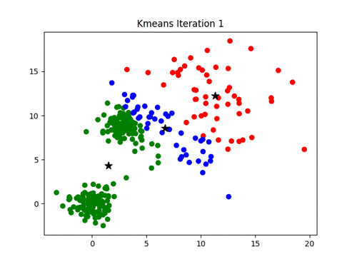
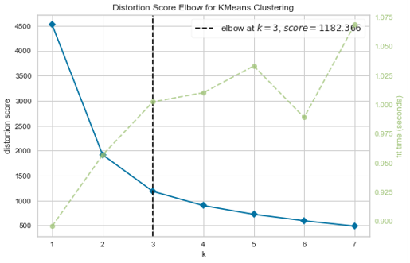
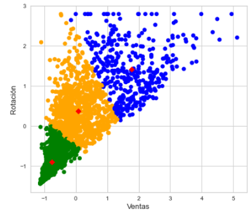
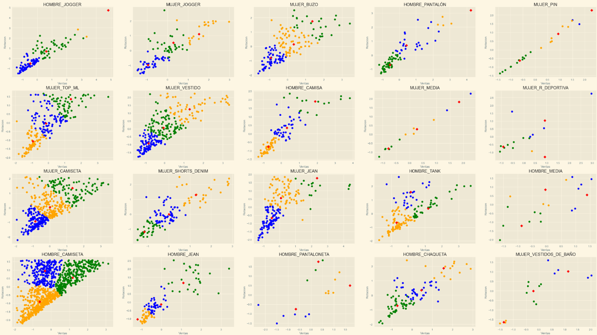
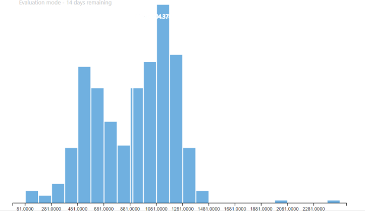

<h1 align="center"> KMeans </h1>

  

 
 
<h2 align="center">🏁 El proyecto se encuentra terminado 🏁 </h2>

<h4> 🔨 Calificar los ítems de una forma cuantitativa automática con K-means 🔨 </h4>

## 📁 Acceso al proyecto

**Este proyecto puede ser descargado como archivo ZIP o realizando una conexión con el http por medio de git**

 

## 🛠️ Abre y ejecuta el proyecto

**Se puede correr el archivo desde la terminal en cualquier sistema operativo**

 
 

## ✅ Tecnologias usadas

- **Python** 
- **Scikit-learn** 
- **Numpy** 
- **Pandas** 
- **Scipy** 
 

`Ventajas` :
- El principio es simple, la implementación es fácil y la velocidad de convergencia es rápida.
- Hay pocos parámetros para ajustar, y generalmente solo el número de clúster K necesita ser ajustado.
- El numero de clasificaciones puede cambiar dependiendo de la necesidad en su momento
- Calificar ítems por medio de sus ventas en un tiempo determinado

 

 `Tipos de datos` : 
 - Se decide usar 3 clusters para la optmizacion del modelo y obtener los resultados mas exactos posibles
 

  
  

 

`Analisis por categoria` :
Teniendo en cuenta que cada categoria tiene ventas y unidades despachadas muy diferentes, el modelo tiene en cuenta esta diferencia para crear unos centroides y una categorizacion distinto para cada uno

  

 

`Lote` : 
Las categorias grandes como Hombre tank y Hombre camiseta tienen diferencias en dos subdivisiones del lote, cambiando fuertemente los resultados del modelo asi que se ha dividido estas categorias en dos lotes diferentes

  

